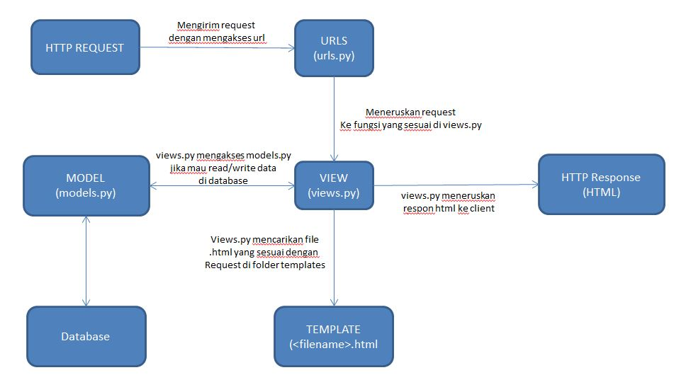

# Live Demo Link 🚀
[Home page 🏠](https://tugas-2-pbp-rifqi.herokuapp.com/)

[Katalog page 📃](https://tugas-2-pbp-rifqi.herokuapp.com/katalog/)

## Bagan request client

## Kenapa menggunakan virtual environtment?
- Karena dengan menggunakan virtual environtment otomatis kita melakukan instalasi packages dan dependencies yang diperlukan dalam framework django yang tidak terinstalasi secara global di local. jika tidak menggunakan virtual environtment, kita hanya bisa sebatas mengakses dari folder/direktori yang telah terinstal. Dengan virtual environtment kita juga dapat membuat lingkungan kerja python yang terisolasi sehingga tidak menganggu ketika kita memiliki project yang banyak.

## Apakah bisa membuat aplikasi web berbasis django tanpa menggunakan virtual environtment?
- Tentu bisa-bisa saja, karena kita tetap bisa menginstall packages dan dependencies yang diperlukan, walaupun diinstall secara global. Akan tetapi, jika pada project dengan skala besar dan banyak seperti django, kivy, Pyforms, dll yang membutuhkan requirments versi yang berbeda, ini akan menyebabkan masalah antar project. Intinya dengan adanya virtual environtment kita dapat mengatasi hal itu dan pada matkul ini menjadi best practice untuk framework django

## Cara mengimplementasikan poin 1 sampai poin 4
1. pada views.py dibuat sebuah fungsi untuk mengambil semua data dari json menggunakan syntax CatalogItem.objects.all() dan mengembalikan data tersebut ke template html menggunakan render().

2. Untuk melakukan routing terhadap fungsi views.py kita harus memasukkan sebuah path pada folder katalog file urls.py dengan perintah path() jangan lupa juga untuk menambahkan path kedalam folder project django juga.

3. Setelah dilakukan perintah loaddata jason yang akan memasukkan data didalamnya ke dalam database django lokal, akan dibuat sebuah variabel context yang akan menyimpan data tersebut. kemudian akan melakukan render dengan perintah render(_____, context)

4. Dengan membuat file Procfile untuk mengatur deployment di Heroku. Dan selanjutnya adalah membuat _new app_ di Heroku dan import repo tugas 2 ini dari GitHub ke Heroku untuk di-deploy. jangan lupa menambahkan api values dan api name pada settingan repository github tugas 2. 

