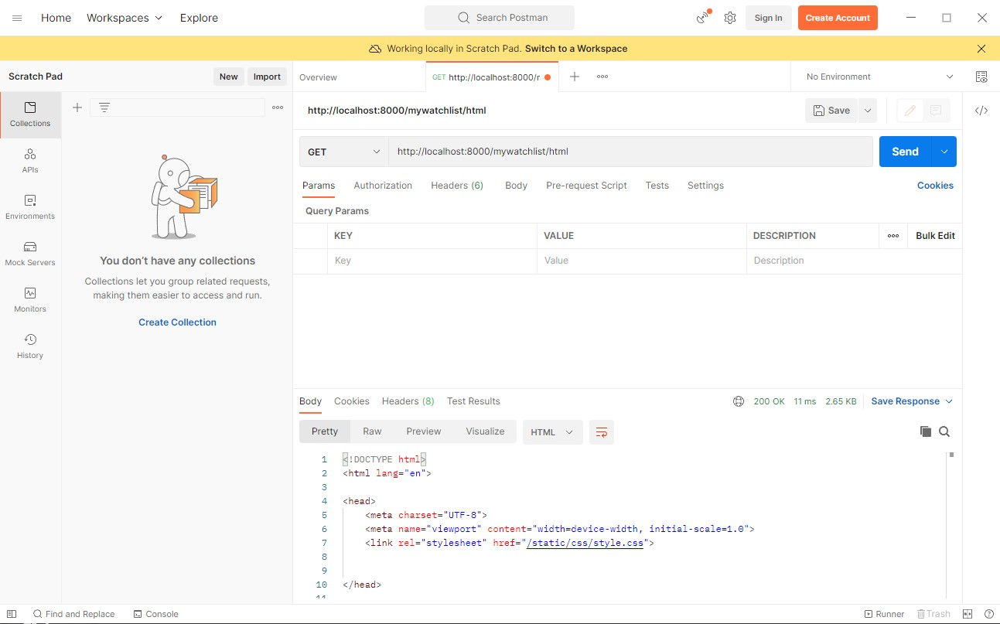
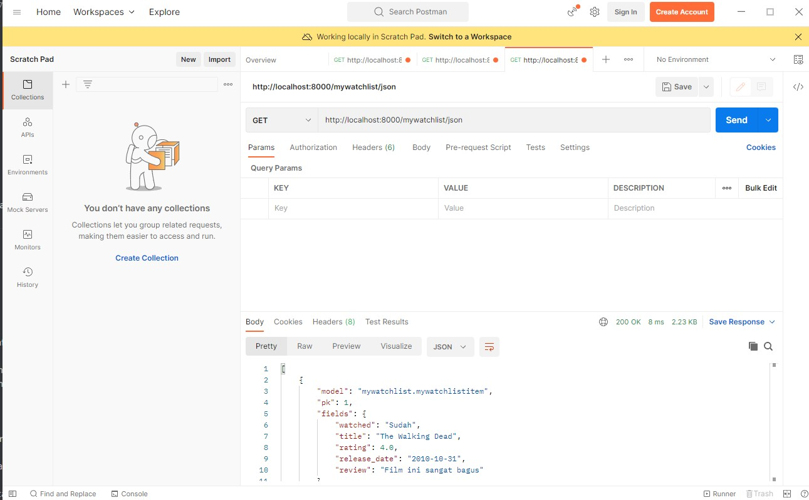
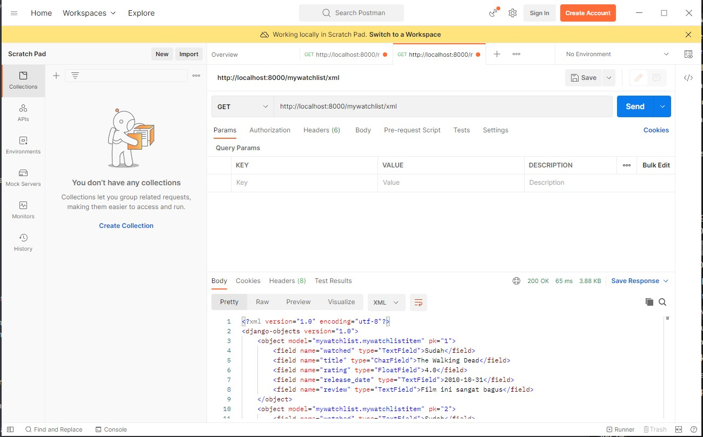

# Live Demo Link 🚀
[HTML page 💻](https://tugas-2-pbp-rifqi.herokuapp.com/mywatchlist/html/)

[JSON page 📃](https://tugas-2-pbp-rifqi.herokuapp.com/mywatchlist/json/)

[XML page 📄](https://tugas-2-pbp-rifqi.herokuapp.com/mywatchlist/xml/)

## Perbedaan JSON, XML, dan HTML
• HTML (HyperText Markup Language)  adalah bahasa markup standar untuk membuat halaman web dan aplikasi web.

• XML (Ekstensible Markup Language) adalah bahasa markup yang mendefinisikan satu set aturan untuk menyandikan dokumen dalam format yang dapat dibaca manusia dan mesin.

• JSON (JavaScript Object Notation) Adalah  format pertukaran data berbasis teks yang menggunakan tipe data teks dan angka untuk merepresentasikan objek. Ini adalah format standar terbuka berdasarkan subset dari bahasa pemrograman JavaScript dan sepenuhnya bebas bahasa.

HTML vs XML:

    Sensitivitas kasus

    •	HTML: HTML tidak peka huruf besar/kecil.

    •	XML: XML peka huruf besar/kecil.

    Tag

    •	HTML: HTML memiliki tag yang telah ditentukan sebelumnya.

    •	XML: programmer mendefinisikan kumpulan tagnya XML.

    Tag Penutup

    •	HTML: Pada HTML, tidak memiliki tag penutup.

    •	XML: Pada XML, wajib untuk menutup setiap tag yang telah digunakan.

    Fokus utama

    •	HTML: HTML berfokus pada menampilkan data.

    •	XML: XML berfokus pada membawa informasi.

    Pemakaian

    •	HTML: HTML membantu mengembangkan struktur halaman web.

    •	XML: XML membantu untuk bertukar data di antara berbagai platform.

JSON vs XML:

    Tipe

    •	JSON adalah bahasa meta.

    •	XML adalah bahasa markup.

    Kompleksitas

    •	JSON sederhana dan mudah dibaca.

    •	XML lebih rumit.

    Orientasi

    •	JSON berorientasi pada data.

    •	XML berorientasi pada dokumen.

    Array

    •	JSON mendukung array.

    •	XML tidak mendukung array.

    Ekstensi File

    •	File JSON diakhiri dengan ekstensi .json.

    •	File XML diakhiri dengan ekstensi .xml

## Mengapa kita memerlukan data delivery dalam pengimplementasian sebuah platform?
Dalam sebuah platform, pasti terjadi pertukaran data antara user dengan data yang ada di dalam server. Data delivery dapat menjadi perantara agar mempermudah kita untuk melakukan pengiriman data. Pengiriman data biiasanya menggunakan format HTML, XML, maupun JSON. Ini akan mempermudah dalam mengolah data karena mudah dibaca dengan menggunakan tag.

## Cara mengimplementasikan poin 1 sampai 6
    1.Membuat aplikasi 'mywatchlist' dengan menjalankan perintah python manage.py startapp mywatchlist di directory TUGAS2PBP

    2. Mengroute url dengan menambahkan path('mywatchlist/', include('mywatchlist.urls')) untuk menghubungkan urlpatterns yang ada pada project_django dengan mywatchlist serta menambahkan mywatchlist pada installed_app yang ada di setting.py. Selanjutnya, melakukan path route dalam mywatchlist/urls.py agar terhubung dengan fungsi yang akan dijalankan pada mywatchlist/views.py

    3. Membuat model data pada mywatchlist/models.py dengan fields watched_movie, movie_name, movie_rating, movie_date, movie_review. Selanjutnya, melakukan migrasi dengan melakukan command python manage.py makemigrations dan python manage.py migrate.

    4. Membuat folder fixtures didalam mywatchlist kemudian membuat file initial_mywatchlist_data.json untuk diiisi 10 data dan akan di load agar dapat ditampilkan kedalam url

    5. membuat implementasi fungsi untuk menampilkan data dalam bentuk html,json, dan xml pada file views.py. Pada html digunakan fungsi render dan pada json/xml digunakan fungsi HttpResponse

    6. sama seperti point 2 tadi kita perlu menambahkan routing buat html,json, dan xml. tinggal menambahkan url di path urls di folder mywatchlist

## Screenshot POSTMAN
1. /mywatchlist/html

2. /mywatchlist/json

3. /mywatchlist/xml

