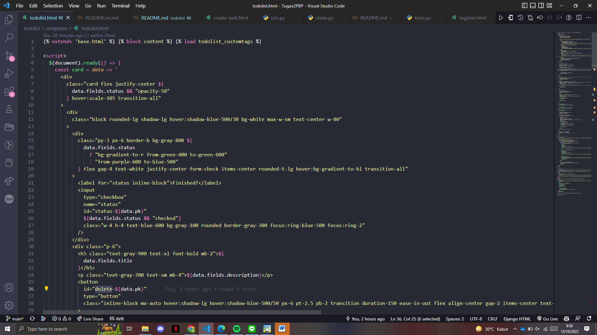
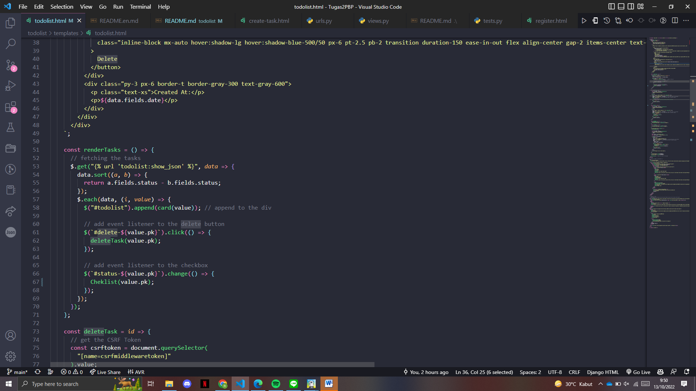
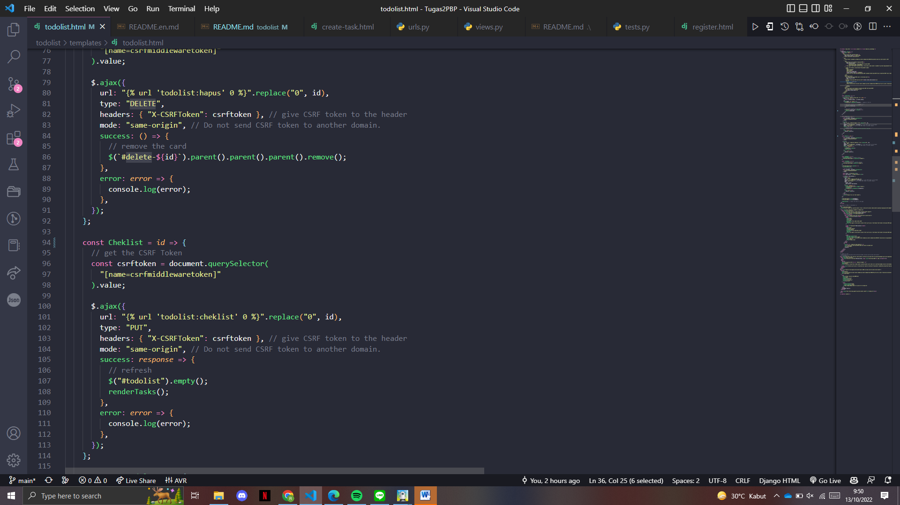
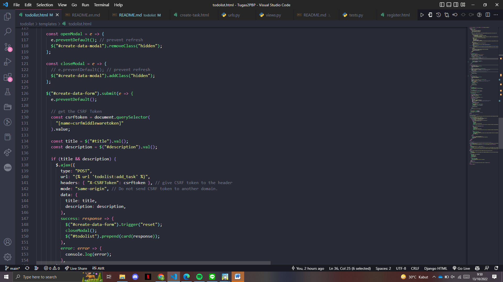
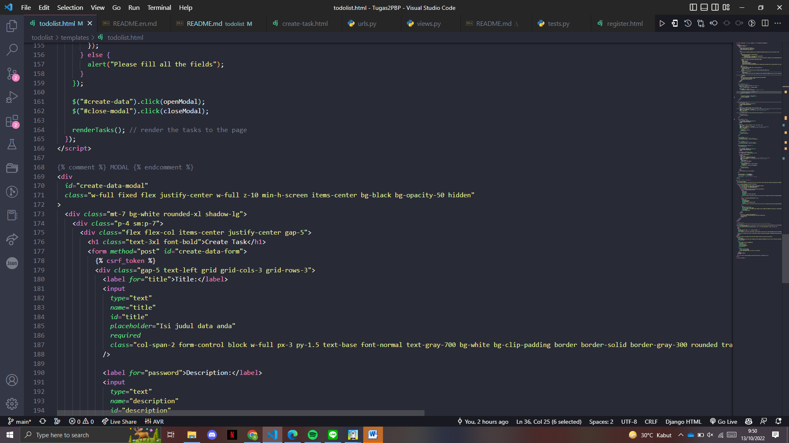
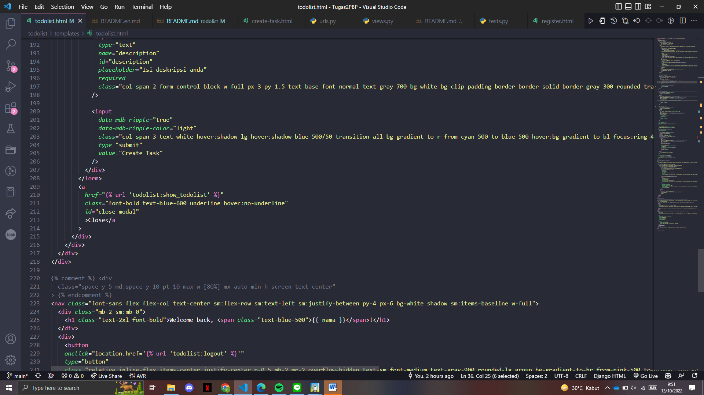
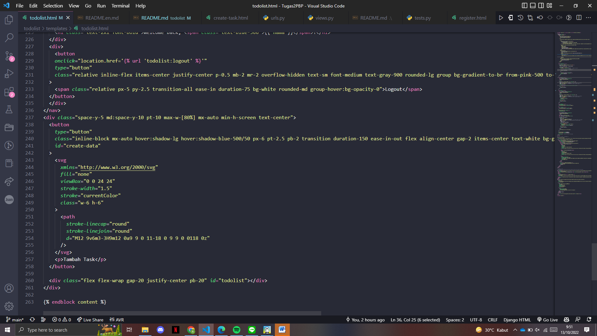

## README TUGAS 6

## 1. Jelaskan perbedaan antara asynchronous programming dengan synchronous programming.
    Synchronus web communication : setiap ada event atau request dari user ke server, maka user menunggu dari server untuk mengenerate yang di req tersebut. Kalau di slide urutan nya : user klick, menunggu server untuk request selanjutnya, refresh halaman (response)

    Asynchronous : gunain ajax asynchronous javascript dan xml. Di sini ada partial page untuk bagian yang diminta saja, jadi gak ngejalanin keseluruhan dari halaman. Bisa sih berinteraksi tapi pada saat loding sm download. Jadi user dapat berinteraksi tanpa harus menunggu page ngerefresh secara keseluruhan

## 2. Dalam penerapan JavaScript dan AJAX, terdapat penerapan paradigma Event-Driven Programming. Jelaskan maksud dari paradigma tersebut dan sebutkan salah satu contoh penerapannya pada tugas ini.
    Event-Driven Programming adalah  paradigma pemrograman di mana eksekusi program ditentukan oleh peristiwa pengguna baru (klik mouse, penekanan tombol), output sensor, atau pesan yang lewat dari program lain. Dalam program ini ada event listener klik yang mendengarkan tombol dengan id tertentu untuk melakukan fungsi tertentu. Misalnya, "create task"

## 3. Jelaskan penerapan asynchronous programming pada AJAX.
    Tambahkan  ke header html. kemudian Tambahkan 
    
    4. membuat fungsi add_task_ajax untuk posting data dengan Ajax
    @login_required(login_url='/todolist/login/')
    def add_task_ajax(request):
    if request.method ==  "POST":
            title = request.POST.get("title")
            description = request.POST.get("description")
            user = request.user
            data = BarangTodolist.objects.create(user=user, title=title, description=description, date=datetime.datetime.today())    
            return JsonResponse({
                "pk": data.pk,
                "fields": {
                    "title": data.title,
                    "description": data.description,
                    "status": data.status,
                    "date": data.date,
                },
            },
            status=200,
            )
    
    5. todolist.html

