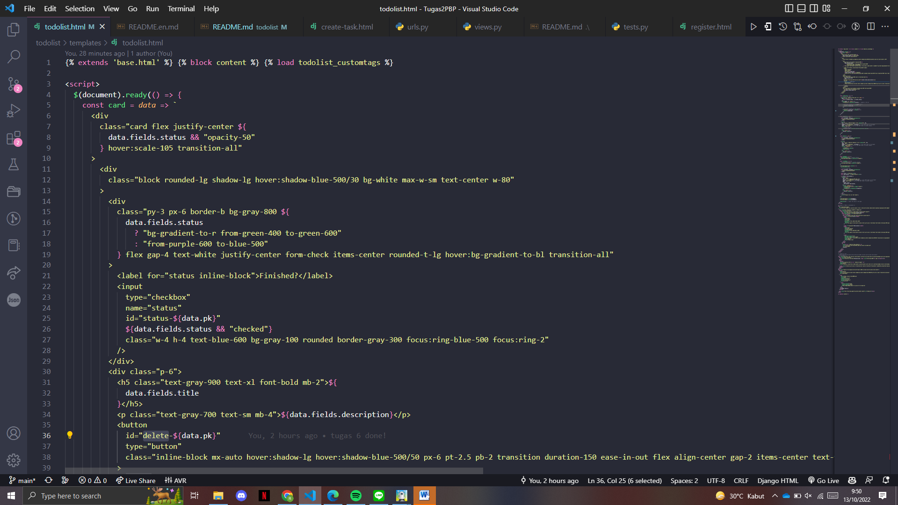
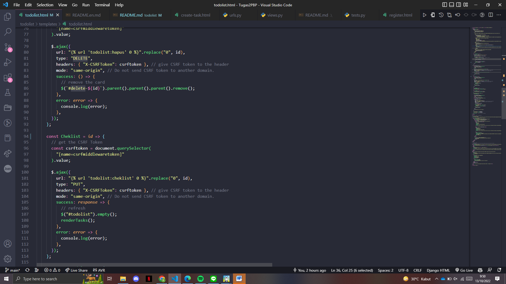
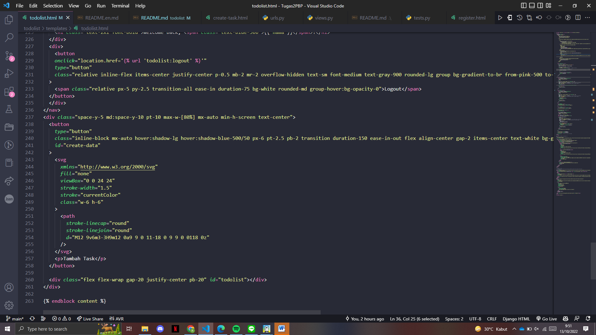

# Live Demo Link 🚀
[TODOLIST page 💻](https://tugas-2-pbp-rifqi.herokuapp.com/todolist/)
[Register Page 📝](https://tugas-2-pbp-rifqi.herokuapp.com/todolist/register)
[Login Page 📃](https://tugas-2-pbp-rifqi.herokuapp.com/todolist/login)
[Create New Task Page 📃](https://tugas-2-pbp-rifqi.herokuapp.com/todolist/create-task)

## Apa kegunaan  pada elemen <form>? Apa yang terjadi apabila tidak ada potongan kode tersebut pada elemen <form>?
    django memiliki tag  untuk menghindari serangan terhadap web aplication yang memanfaatkan bug atau vulnerability pada Web Application yang bekerja dengan cara mengeksploitasi suatu task dari sebuah Web dengan memanfaatkan Autentikasi yang dimiliki oleh korban. Hal ini biasanya di karenakan kode yang sangat buruk sewaktu developmentya sehingga menghasilkan bug tersebut yang dapat di salah gunakan oleh orang lain dengan maksud negatif. Django membuat proses ini mulus dengan penambahan tag sederhana ke form yang dihasilkan. Untuk menggunakanya sangat simple kita hanya perlu menyisipkanya di dalam <form> yang ingin kita insert atau update delete. apabila tidak ada potongan kode ini, serangan csrf tidak dapat dihindari senhinga mengancam keamanan post request dari user ke server

## Apakah kita dapat membuat elemen <form> secara manual (tanpa menggunakan generator seperti {{ form.as_table }})? Jelaskan secara gambaran besar bagaimana cara membuat <form> secara manual.
    Jawabannya mungkin bisa-bisa saja. Jika kita membuat elemen <form> tanpa menggunakan {{ form.as_table }} mungkin ada beberapa variable yang ada di database tidak memerlukan di-POST sehingga kita dapat membuat form manual untuk mengatasi hal tersebut. Kita harus menambahkan method post di form manual dan akan diisi csrf token. Kemudian kita harus melengkapi tag input sesuai dengan kebutuhan dan name untuk identifier. Form akan mengakses input ketika user mengklik submit dengan menggunakan method request.POST.get()

##  Jelaskan proses alur data dari submisi yang dilakukan oleh pengguna melalui HTML form, penyimpanan data pada database, hingga munculnya data yang telah disimpan pada template HTML.

    1. user menekan tombol submit
    2. form mengakses data input dengan menggunakan method request.POST.get()
    3. membuat objek baru yang aan disimpan ke database dengan cara data = BarangTodolist(user=user, title=title, description=description)
    4. kita dapat mengakses data yang tersimpan di database django dengan cara "Models".objects.filter(user=request.user) 
    5. deliver data kedalam context dan kita return render dengan target html, setelah itu di html kita langsung bisa mengiterasi data menggunakan loop seperti yang diajarkan di lab dan data akan ditampilkan pada html

## Jelaskan bagaimana cara kamu mengimplementasikan checklist di atas.
    1. Ketik di terminal directory Tugas2PBP python manage.py startapp todolist 

    2. nambahin path('todolist/', include('todolist.urls')), ke urls.py yang ada di project django

    3. Membuat class di todolist/models.py dan membuatnya field sesuai kriteria yang diminta

    4. buat fungsi login,logout,register yang dapat dihubungkan ke login.html dan register.html. kurang lebih sama kayak pengerjaan tutorial lab 3

    5. Kita akan membuat variable context yang akan menyimpan data-data yang diperlukan untuk ditampilkan pada html. pada todolist.html kita harus menampilkan data dengan cara mengiterasi field yang ada di model menggunakan for each loop kemudian menambahkan 2 buah button untuk create-task dan logout. Kemudian membuat tabel untuk menampilkan data-datanya. kurang lebih codingannya adalah :
    
    <tr>
        <th>{{todolist.title}}</th>
        <th>{{todolist.date}}</th>
        <th>{{todolist.description}}</th>
        
        <th>Belum Selesai</th>
        
        <th>Selesai</th>
        
        <th><a href=""><button>Check</button></th>
        <th><a href=""><button>Delete</button></th>
    </tr>
    

    6. Pada create-task.html kita perlu menambahkan form input tittle dan description seperti ini:
        <tr>
            <td>Tittle: </td>
            <td><input type="text" name="title" placeholder="TITTLE" class="form-control"></td>
        </tr>
                
        <tr>
            <td>Description: </td>
            <td><input type="text" name="description" placeholder="DESCRIPTION" class="form-control"></td>
        </tr>
    kita juga harus menambahkan button submit buat yang akan diikirim ke fungsi tambah_input di views.py untuk ditambahkan kke database

    7. sama seperti point 2 tadi, kita akan menambahkan routing path /todolist/login,register,create-task,logout

## Akun dummy
    Akun 1 :
    ussername = icuncantik
    password = pbp@2022
    akun 2 :
    ussername : icunburik
    password = pbp@2022

## README TUGAS 5
## Apa perbedaan dari Inline, Internal, dan External CSS? Apa saja kelebihan dan kekurangan dari masing-masing style?
    Internal : Internal CSS adalah kode CSS yang ditulis di dalam tag <style> dan kode HTML dituliskan di bagian atas (header) file HTML. Internal CSS dapat digunakan untuk membuat tampilan pada satu halaman website dan tidak digunakan pada halaman website yang lain.
    Cara ini akan sangat cocok dipakai untuk menciptakan halaman web dengan tampilan yang berbeda. Dengan kata lain, Internal CSS ini bisa dipakai untuk menciptakan tampilan yang unik, pada setiap halaman website.

    External : Eksternal CSS adalah kode CSS yang ditulis terpisah dengan kode HTML Eksternal CSS ditulis di sebuah file khusus yang berekstensi .css. File eksternal CSS biasanya diletakkan setelah bagian <head> pada halaman.
    Cara ini lebih sederhana dan simpel daripada menambahkan kode CSS di setiap elemen HTML yang ingin Anda atur tampilannya. 

    Inline : Inline CSS adalah kode CSS yang ditulis langsung pada atribut elemen HTML. Setiap elemen HTML memiliki atribut style, di situ lah inline CSS ditulis.
    Cara ini kurang efisien karena setiap tag HTML yang diberikan harus memiliki style masing-masing. Anda akan lebih sulit dalam mengatur website jika hanya menggunakan inline style CSS. Sebab, Inline CSS digunakan hanya untuk mengubah satu elemen saja.

## Jelaskan tag HTML5 yang kamu ketahui
	 
    <!DOCTYPE>	Tag untuk menentukan tipe dokumen
    <html>	Tag untuk membuat sebuah dokumen HTML
    <title>	Tag untuk membuat judul dari sebuah halaman
    <body>	Tag untuk membuat tubuh dari sebuah halaman
    <h1> to <h6>	Tag untuk membuat heading
    
	Tag untuk membuat paragraf
     	Memasukan satu baris putus
    
	Tag untuk membuat perubahan dasar kata didalam isi
    <!--...-->	Tag untuk membuat komentar
    <form>	Tag untuk membuat sebuah form HTML untuk input pengguna
    <input>	Tag untuk membuat sebuah kontrol input
    <textarea>	Tag untuk membuat sebuah kontrol input multibaris (text area)

    dan masih banyak lagi..

## Tipe-Tipe CSS Selector
    Universal Selector : Memilih semua elemen html. Syntax: *

    Type Selector : Memilih semua elemen node namenya sesuai. Contoh: type selector p akan memilih semua elemen 

    Class Selector : Memilih semua elemen yang punya attribut class yang sesuai. Contoh: .card akan memilih semua elemen yang punya class card

    ID Selector : Memilih sebuah elemen berdasarkan nilai attribut idnya. Misalnya: #user akan memilih elemen yang punya id "user".

    Attribut selector : Memilih semua elemen yang punya attribut. Contoh: [href] akan memilih semua elemen yang punya attribut href. 

## Implementasi checklist
## Menambahkan tag `<link>` pada base.html untuk menggunakan CDN dari tailwind css
saya menambahkan scrip buat tailwind dan bootstrap buat berjaga-jaga kalo mau nge mix

## Implementasi Kustomisasi Login, Register, dan Create-task
login

Register 

Create-task

## Implementasi halaman utama todolist

## README TUGAS 6

## 1. Jelaskan perbedaan antara asynchronous programming dengan synchronous programming.
    Synchronus web communication : setiap ada event atau request dari user ke server, maka user menunggu dari server untuk mengenerate yang di req tersebut. Kalau di slide urutan nya : user klick, menunggu server untuk request selanjutnya, refresh halaman (response)

    Asynchronous : gunain ajax asynchronous javascript dan xml. Di sini ada partial page untuk bagian yang diminta saja, jadi gak ngejalanin keseluruhan dari halaman. Bisa sih berinteraksi tapi pada saat loding sm download. Jadi user dapat berinteraksi tanpa harus menunggu page ngerefresh secara keseluruhan

## 2. Dalam penerapan JavaScript dan AJAX, terdapat penerapan paradigma Event-Driven Programming. Jelaskan maksud dari paradigma tersebut dan sebutkan salah satu contoh penerapannya pada tugas ini.
    Event-Driven Programming adalah  paradigma pemrograman di mana eksekusi program ditentukan oleh peristiwa pengguna baru (klik mouse, penekanan tombol), output sensor, atau pesan yang lewat dari program lain. Dalam program ini ada event listener klik yang mendengarkan tombol dengan id tertentu untuk melakukan fungsi tertentu. Misalnya, "create task"

## 3. Jelaskan penerapan asynchronous programming pada AJAX.
    Tambahkan  ke header html. kemudian Tambahkan 
    
    4. membuat fungsi add_task_ajax untuk posting data dengan Ajax
    @login_required(login_url='/todolist/login/')
    def add_task_ajax(request):
    if request.method ==  "POST":
            title = request.POST.get("title")
            description = request.POST.get("description")
            user = request.user
            data = BarangTodolist.objects.create(user=user, title=title, description=description, date=datetime.datetime.today())    
            return JsonResponse({
                "pk": data.pk,
                "fields": {
                    "title": data.title,
                    "description": data.description,
                    "status": data.status,
                    "date": data.date,
                },
            },
            status=200,
            )
    
    5. todolist.html

